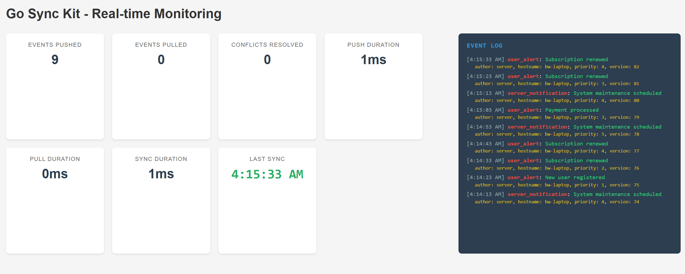

# Go Sync Kit

A generic, event-driven synchronization library for distributed Go applications. Go Sync Kit enables offline-first architectures with conflict resolution and pluggable storage backends.

## 🤖 Project Origins & Collaboration

**Transparency First**: This project was created with the assistance of Large Language Models (LLMs) as a starting point for a collaborative open-source initiative. 

**Why I'm Sharing This**: I'm passionate about learning Go and improving my programming skills. Rather than keeping this as a solo project, I'm open-sourcing it to:

- **Learn from the community** - Your code reviews, suggestions, and contributions will help me grow as a developer
- **Collaborate together** - Let's build something useful while learning from each other
- **Test the concept** - See if there's genuine interest in this approach to synchronization in Go
- **Practice open-source** - Experience the full cycle of maintaining and growing an open-source project

If you're interested in **mentoring**, **contributing**, or **learning alongside me**, I'd love to hear from you! Whether you're a Go expert or fellow learner, all perspectives are valuable.

> 💡 **Note**: While LLMs helped with the initial implementation, all future development will be driven by real-world needs, community feedback, and collaborative human insight.

## Features

### Core Features
- **Event-Driven Architecture**: Built around append-only event streams
- **Offline-First**: Full support for offline operation with automatic sync when reconnected
- **Pluggable Components**: Interfaces for storage, transport, versioning, and conflict resolution
- **Conflict Resolution**: Multiple strategies including last-write-wins, merge, and custom resolvers
- **Concurrent Safe**: Thread-safe operations with proper synchronization

### Transport & Storage
- **Transport Agnostic**: Works with HTTP, gRPC, WebSockets, NATS, or any custom transport
- **Storage Agnostic**: Compatible with SQLite, BadgerDB, PostgreSQL, or any storage backend
- **Advanced Vector Clocks**: Enhanced vector clock implementation with validation and safety limits
- **Context Aware**: Full context support with timeouts and cancellation for all operations

### Performance & Reliability
- **Improved Error Handling**: Enhanced error system with error codes and metadata
- **Metrics Collection**: Built-in metrics tracking for sync operations and performance monitoring
- **Automatic Sync**: Configurable periodic synchronization with exponential backoff
- **Efficient Batching**: Optimized batch processing for large event sets
- **Comprehensive Testing**: Over 90% test coverage with context and race condition testing

### Configuration & Safety
- **Builder Pattern**: Enhanced builder with validation, timeouts, and compression options
- **Filtering**: Sync only specific events based on custom filters
- **Safety Limits**: Configurable limits to prevent resource exhaustion
- **Validation Options**: Built-in validation for sync parameters and configurations

## Installation

```bash
go get github.com/c0deZ3R0/go-sync-kit
```

## Basic Example

Go Sync Kit includes a complete basic example that demonstrates core functionality with a real-time web dashboard. This example serves as a foundation for more complex implementations.



### Running the Example

```bash
# Clone the repository
git clone https://github.com/c0deZ3R0/go-sync-kit
cd go-sync-kit

# Run the example
cd example
go run .

# Open the dashboard
open http://localhost:8080
```

The example includes:
- Real-time event synchronization
- Live monitoring dashboard
- Event terminal with metadata
- Metrics collection and display
- Basic conflict resolution

See the [example README](example/README.md) for more details about the implementation and how to extend it.

## Quick Start

```go
package main

import (
    "context"
    "log"
    "net/http"
    "os"
    "time"

    "github.com/c0deZ3R0/go-sync-kit/storage/sqlite"
    synckit "github.com/c0deZ3R0/go-sync-kit"
    "github.com/c0deZ3R0/go-sync-kit/transport/httptransport"
)

type MyEvent struct {
    id          string
    eventType   string
    aggregateID string
    data        interface{}
    metadata    map[string]interface{}
}

func (e *MyEvent) ID() string { return e.id }
func (e *MyEvent) Type() string { return e.eventType }
func (e *MyEvent) AggregateID() string { return e.aggregateID }
func (e *MyEvent) Data() interface{} { return e.data }
func (e *MyEvent) Metadata() map[string]interface{} { return e.metadata }

func main() {
    // Create SQLite Event Store
    storeConfig := &sqlite.Config{DataSourceName: "file:events.db", EnableWAL: true}
    store, err := sqlite.New(storeConfig)
    if err != nil {
        log.Fatalf("Failed to create SQLite store: %v", err)
    }
    defer store.Close()

    // Set up HTTP server with SyncHandler
    logger := log.New(os.Stdout, "[SyncHandler] ", log.LstdFlags)
// Use default version parser (store.ParseVersion)
handler := transport.NewSyncHandler(store, logger, nil)
    server := &http.Server{Addr: ":8080", Handler: handler}
	
    go func() {
        if err := server.ListenAndServe(); err != nil {
            log.Fatalf("Failed to start server: %v", err)
        }
    }()

    // Set up HTTP Client with HTTPTransport
    clientTransport := transport.NewTransport("http://localhost:8080", nil)

    // Configure Sync Options
    syncOptions := &synckit.SyncOptions{
        BatchSize: 10,
        SyncInterval: 10 * time.Second,
    }

    // Create and start SyncManager
    syncManager := synckit.NewSyncManager(store, clientTransport, syncOptions)
    ctx := context.Background()

    // Run synchronization
    result, err := syncManager.Sync(ctx)
    if err != nil {
        log.Fatalf("Sync error: %v", err)
    }
    log.Printf("Sync completed: %+v", result)
}
```

```go
package main

import (
    "context"
    "fmt"
    "log"
    "os"
    "time"

    "github.com/c0deZ3R0/go-sync-kit"
    "github.com/c0deZ3R0/go-sync-kit/storage/sqlite"
)

// Implement your event type
type MyEvent struct {
    id          string
    eventType   string
    aggregateID string
    data        interface{}
    metadata    map[string]interface{}
}

func (e *MyEvent) ID() string { return e.id }
func (e *MyEvent) Type() string { return e.eventType }
func (e *MyEvent) AggregateID() string { return e.aggregateID }
func (e *MyEvent) Data() interface{} { return e.data }
func (e *MyEvent) Metadata() map[string]interface{} { return e.metadata }

func main() {
    // Create an SQLite event store
    logger := log.New(os.Stdout, "[SQLite EventStore] ", log.LstdFlags)
    config := &sqlite.Config{
        DataSourceName: "file:events.db",
        Logger:         logger,
        EnableWAL:      true,  // Enable WAL for better concurrency
    }

    store, err := sqlite.New(config)
    if err != nil {
        log.Fatalf("Failed to create SQLite store: %v", err)
    }
    defer store.Close()

    // Create a transport
    transport := &MyTransport{} // Your Transport implementation

    // Configure sync options
    options := &synckit.SyncOptions{
        BatchSize:        100,
        SyncInterval:     30 * time.Second,
        ConflictResolver: &LastWriteWinsResolver{},
    }

    // Create sync manager
    syncManager := synckit.NewSyncManager(store, transport, options)

    // Perform sync
    ctx := context.Background()
    result, err := syncManager.Sync(ctx)
    if err != nil {
        log.Fatalf("Sync failed: %v", err)
    }

    fmt.Printf("Synced: %d pushed, %d pulled\n", 
        result.EventsPushed, result.EventsPulled)
}
```


## Release Information

See [CHANGELOG.md](CHANGELOG.md) for detailed release notes and version history.

Latest version: **v0.6.0** - Introduces a comprehensive example with real-time dashboard demonstrating Go Sync Kit's core features.

## Architecture
Go Sync Kit follows clean architecture principles with clear separation of concerns:

```
┌─────────────────┐    ┌─────────────────┐    ┌─────────────────┐
│   Application   │    │   SyncManager   │    │    Transport    │
│                 │───▶│                 │───▶│                 │
│  (Your Code)    │    │  (Coordination) │    │   (Network)     │
└─────────────────┘    └─────────────────┘    └─────────────────┘
                               │
                               ▼
                    ┌─────────────────┐    ┌─────────────────┐
                    │   EventStore    │    │ ConflictResolver │
                    │                 │    │                 │
                    │   (Storage)     │    │  (Resolution)   │
                    └─────────────────┘    └─────────────────┘
```

## Core Interfaces

### Event
Represents a syncable event in your system:

```go
type Event interface {
    ID() string
    Type() string
    AggregateID() string
    Data() interface{}
    Metadata() map[string]interface{}
}
```

### Version
Handles versioning for sync operations:

```go
type Version interface {
    Compare(other Version) int
    String() string
    IsZero() bool
}
```

### EventStore
Provides persistence for events:

```go
type EventStore interface {
    Store(ctx context.Context, event Event, version Version) error
    Load(ctx context.Context, since Version) ([]EventWithVersion, error)
    LoadByAggregate(ctx context.Context, aggregateID string, since Version) ([]EventWithVersion, error)
    LatestVersion(ctx context.Context) (Version, error)
    Close() error
}
```

### Transport
Handles network communication:

```go
type Transport interface {
    Push(ctx context.Context, events []EventWithVersion) error
    Pull(ctx context.Context, since Version) ([]EventWithVersion, error)
    Subscribe(ctx context.Context, handler func([]EventWithVersion) error) error
    Close() error
}
```

### ConflictResolver
Resolves conflicts when the same data is modified concurrently:

```go
type ConflictResolver interface {
    Resolve(ctx context.Context, local, remote []EventWithVersion) ([]EventWithVersion, error)
}
```

## Conflict Resolution Strategies

Go Sync Kit supports multiple conflict resolution strategies:

### Last-Write-Wins
```go
type LastWriteWinsResolver struct{}

func (r *LastWriteWinsResolver) Resolve(ctx context.Context, local, remote []EventWithVersion) ([]EventWithVersion, error) {
    // Keep the events with the latest timestamp
    var resolved []EventWithVersion
    // Implementation logic here...
    return resolved, nil
}
```

### Custom Merge Strategy
```go
type CustomMergeResolver struct{}

func (r *CustomMergeResolver) Resolve(ctx context.Context, local, remote []EventWithVersion) ([]EventWithVersion, error) {
    // Implement your custom merge logic
    // Could merge data fields, prompt user, etc.
    return mergedEvents, nil
}
```

## Configuration Options

```go
type SyncOptions struct {
    // Sync direction control
    PushOnly bool
    PullOnly bool
    
    // Conflict handling
    ConflictResolver ConflictResolver
    
    // Event filtering
    Filter func(Event) bool
    
    // Performance tuning
    BatchSize int
    SyncInterval time.Duration
}
```

### Example with filtering:
```go
options := &synckit.SyncOptions{
    BatchSize: 50,
    Filter: func(e synckit.Event) bool {
        // Only sync specific event types
        return e.Type() == "UserCreated" || e.Type() == "OrderPlaced"
    },
}
```

## Versioning Strategies

Go Sync Kit supports multiple versioning strategies suitable for different architectures.

### Vector Clocks (Recommended for Distributed Systems)

For multi-master, peer-to-peer, or offline-first scenarios where writes can happen on multiple nodes concurrently, using a vector clock is the recommended approach. The library provides a `VersionedStore` decorator that manages versioning logic automatically.

**Key Benefits:**
- **Causal ordering**: Determines if events happened-before, happened-after, or are concurrent
- **Conflict detection**: Automatically identifies conflicting concurrent writes
- **Distributed-friendly**: No central coordination required
- **Offline-first**: Works perfectly for disconnected clients

**Usage:**

```go
import (
    "github.com/c0deZ3R0/go-sync-kit/storage/sqlite"
    "github.com/c0deZ3R0/go-sync-kit/version"
    sync "github.com/c0deZ3R0/go-sync-kit"
)

// 1. Create a base store (e.g., SQLite)
storeConfig := &sqlite.Config{DataSourceName: "file:events.db", EnableWAL: true}
baseStore, err := sqlite.New(storeConfig)
if err != nil {
    // handle error
}

// 2. Define a unique ID for the current node
nodeID := "client-A"

// 3. Create a vector clock version manager
versionManager := version.NewVectorClockManager()

// 4. Wrap the base store with the VersionedStore decorator
versionedStore, err := version.NewVersionedStore(baseStore, nodeID, versionManager)
if err != nil {
    // handle error
}

// 5. Use the decorated store. It now handles vector clock versioning automatically.
syncManager := sync.NewSyncManager(versionedStore, transport, options)

// When you store an event, the version is managed automatically
err = versionedStore.Store(ctx, myNewEvent, nil) // nil means auto-generate version
```

**Real-world Example:**

```go
// Node A creates an event
nodeAStore.Store(ctx, userCreatedEvent, nil)
// Result: {"A": 1}

// Node B creates an event independently  
nodeBStore.Store(ctx, orderPlacedEvent, nil)
// Result: {"B": 1}

// When nodes sync, vector clocks detect concurrent operations
// and enable proper conflict resolution
```

### Simple Versioning (Default)

For single-master or centralized scenarios, you can use simpler versioning strategies like timestamps or sequential IDs. The underlying storage implementations (like SQLite) handle this automatically.

```go
// SQLite store uses timestamp-based versioning by default
store, err := sqlite.New(config)
// No decorator needed - works out of the box
```

### Custom Versioning Strategies

You can implement your own versioning strategy by implementing the `VersionManager` interface:

```go
type CustomVersionManager struct {
    // Your custom state
}

func (vm *CustomVersionManager) CurrentVersion() synckit.Version
    // Return current version
}

func (vm *CustomVersionManager) NextVersion(nodeID string) synckit.Version
    // Generate next version
}

func (vm *CustomVersionManager) UpdateFromVersion(version sync.Version) error {
    // Update internal state from observed version
}

func (vm *CustomVersionManager) Clone() VersionManager {
    // Create a copy
}
```

## Storage Implementations

### SQLite Example
```go
type SQLiteEventStore struct {
    db *sql.DB
}

func (s *SQLiteEventStore) Store(ctx context.Context, event Event, version Version) error {
    query := `INSERT INTO events (id, type, aggregate_id, data, version) VALUES (?, ?, ?, ?, ?)`
    _, err := s.db.ExecContext(ctx, query, event.ID(), event.Type(), 
        event.AggregateID(), event.Data(), version.String())
    return err
}

// Implement other EventStore methods...
```

### BadgerDB Example
```go
type BadgerEventStore struct {
    db *badger.DB
}

func (b *BadgerEventStore) Store(ctx context.Context, event Event, version Version) error {
    return b.db.Update(func(txn *badger.Txn) error {
        key := []byte(fmt.Sprintf("event:%s", event.ID()))
        eventData := EventWithVersion{Event: event, Version: version}
        data, err := json.Marshal(eventData)
        if err != nil {
            return err
        }
        return txn.Set(key, data)
    })
}
```

## Transport Implementations

### Built-in HTTP Transport

Go Sync Kit includes a production-ready HTTP transport implementation that provides both client and server components.

#### Client Setup
```go
import "github.com/c0deZ3R0/go-sync-kit/transport/httptransport"

// Create HTTP transport client
clientTransport := httptransport.NewTransport("http://localhost:8080", nil)

// Use with SyncManager
syncManager := synckit.NewSyncManager(store, clientTransport, options)
```

#### Server Setup
```go
import "github.com/c0deZ3R0/go-sync-kit/transport/httptransport"

// Create HTTP sync handler
logger := log.New(os.Stdout, "[SyncHandler] ", log.LstdFlags)
// Use default version parser (store.ParseVersion)
handler := httptransport.NewSyncHandler(store, logger, nil)

// Start HTTP server
server := &http.Server{Addr: ":8080", Handler: handler}
go server.ListenAndServe()
```

#### API Endpoints

The HTTP transport provides two RESTful endpoints:

- **POST /push** - Accepts events to be stored on the server
- **GET /pull?since=<version>** - Returns events since the specified version

#### Features

- **JSON serialization** with proper interface handling
- **Context cancellation** support
- **Comprehensive error handling** with HTTP status codes
- **Storage-agnostic** server implementation
- **Configurable HTTP client** for custom timeouts, TLS, etc.
- **Batch processing** for efficient sync operations
- **Flexible version parsing** with custom version parser support

#### Version Parsing

Both client and server support custom version parsing through an injectable `VersionParser` function:

```go
// Define a custom parser that requires a 'v' prefix
customParser := func(ctx context.Context, s string) (synckit.Version, error) {
    if !strings.HasPrefix(s, "v") {
        return nil, fmt.Errorf("version must start with 'v'")
    }
    // Strip 'v' prefix and parse as integer
    seq, err := strconv.ParseUint(s[1:], 10, 64)
    if err != nil {
        return nil, fmt.Errorf("invalid version number: %w", err)
    }
    return cursor.IntegerCursor{Seq: seq}, nil
}

// Use custom parser in client transport
clientTransport := httptransport.NewTransport("http://localhost:8080", nil, customParser)

// Use same parser in server handler for consistent version parsing
handler := httptransport.NewSyncHandler(store, logger, customParser)
```

If no parser is provided, the transport falls back to using the store's `ParseVersion` method:

#### Complete Client/Server Example
```go
package main

import (
    "context"
    "log"
    "net/http"
    "os"
    "time"

    "github.com/c0deZ3R0/go-sync-kit/storage/sqlite"
synckit "github.com/c0deZ3R0/go-sync-kit"
"github.com/c0deZ3R0/go-sync-kit/transport/httptransport"
)

func main() {
    // 1. Create SQLite store
    store, err := sqlite.NewWithDataSource("file:events.db")
    if err != nil {
        log.Fatal(err)
    }
    defer store.Close()

    // 2. Start HTTP server
    logger := log.New(os.Stdout, "[SyncHandler] ", log.LstdFlags)
// Use default version parser (store.ParseVersion)
handler := transport.NewSyncHandler(store, logger, nil)
    server := &http.Server{Addr: ":8080", Handler: handler}
    
    go func() {
        log.Println("Starting sync server on :8080")
        if err := server.ListenAndServe(); err != nil {
            log.Printf("Server error: %v", err)
        }
    }()

    // Give server time to start
    time.Sleep(100 * time.Millisecond)

    // 3. Create HTTP client transport
    clientTransport := transport.NewTransport("http://localhost:8080", nil)

    // 4. Configure sync options
    syncOptions := &synckit.SyncOptions{
        BatchSize: 10,
        SyncInterval: 10 * time.Second,
    }

    // 5. Create sync manager
    syncManager := sync.NewSyncManager(store, clientTransport, syncOptions)

    // 6. Perform synchronization
    ctx := context.Background()
    result, err := syncManager.Sync(ctx)
    if err != nil {
        log.Fatalf("Sync failed: %v", err)
    }

    log.Printf("Sync completed: %d pushed, %d pulled", 
        result.EventsPushed, result.EventsPulled)
}
```

### Custom HTTP Transport Example
```go
type CustomHTTPTransport struct {
    client  *http.Client
    baseURL string
}

func (h *CustomHTTPTransport) Push(ctx context.Context, events []EventWithVersion) error {
    data, err := json.Marshal(events)
    if err != nil {
        return err
    }
    
    req, err := http.NewRequestWithContext(ctx, "POST", 
        h.baseURL+"/custom/push", bytes.NewBuffer(data))
    if err != nil {
        return err
    }
    
    resp, err := h.client.Do(req)
    if err != nil {
        return err
    }
    defer resp.Body.Close()
    
    return nil
}
```

### NATS Transport Example (with Watermill)
```go
type NATSTransport struct {
    publisher  message.Publisher
    subscriber message.Subscriber
}

func (n *NATSTransport) Push(ctx context.Context, events []EventWithVersion) error {
    for _, event := range events {
        data, err := json.Marshal(event)
        if err != nil {
            return err
        }
        
        msg := message.NewMessage(watermill.NewUUID(), data)
        err = n.publisher.Publish("sync.events", msg)
        if err != nil {
            return err
        }
    }
    return nil
}
```

## Advanced Usage

### Automatic Sync
```go
// Start automatic sync every 30 seconds
ctx := context.Background()
err := syncManager.StartAutoSync(ctx)
if err != nil {
    log.Fatal(err)
}

// Stop automatic sync
err = syncManager.StopAutoSync()
```

### Event Subscriptions
```go
err := syncManager.Subscribe(func(result *sync.SyncResult) {
    log.Printf("Sync completed: %d events pushed, %d pulled, %d conflicts resolved",
        result.EventsPushed, result.EventsPulled, result.ConflictsResolved)
    
    if len(result.Errors) > 0 {
        log.Printf("Sync errors: %v", result.Errors)
    }
})
```

### Manual Push/Pull
```go
// Push only local changes
result, err := syncManager.Push(ctx)

// Pull only remote changes  
result, err := syncManager.Pull(ctx)
```

## Testing

Go Sync Kit is designed for testability with mock implementations included:

```go
func TestMySync(t *testing.T) {
    store := &MockEventStore{}
    transport := &MockTransport{}
    resolver := &MockConflictResolver{}
    
    sm := sync.NewSyncManager(store, transport, &sync.SyncOptions{
        ConflictResolver: resolver,
    })
    
    // Test your sync logic
    result, err := sm.Sync(context.Background())
    assert.NoError(t, err)
    assert.Equal(t, 1, result.EventsPushed)
}
```

Run tests:
```bash
go test ./...
```

## Performance Considerations

- **Batching**: Use appropriate batch sizes for your network conditions
- **Filtering**: Apply filters to reduce sync overhead
- **Storage**: Choose storage backends appropriate for your scale
- **Conflict Resolution**: Simple strategies (like last-write-wins) are faster than complex merging

## Roadmap

### Completed ✅
- [x] **Enhanced Context Support** - Comprehensive context handling with timeouts and cancellation
- [x] **Advanced Vector Clocks** - Complete implementation with validation and safety limits
- [x] **SQLite EventStore** - Production-ready SQLite implementation with WAL support
- [x] **Vector Clock Versioning** - Complete implementation with VersionedStore decorator
- [x] **HTTP Transport** - Production-ready HTTP transport with context support
- [x] **Metrics Collection** - Built-in metrics tracking for sync operations
- [x] **Error System** - Enhanced error handling with codes and metadata
- [x] **Builder Pattern** - Improved configuration with validation

### Next Up 🚀
- [ ] **Storage Implementations**
  - [ ] BadgerDB store with atomic operations
  - [ ] PostgreSQL store with LISTEN/NOTIFY
  - [ ] Redis store with pub/sub support
- [ ] **Transport Layer**
  - [ ] gRPC transport with streaming
  - [ ] WebSocket transport for real-time sync
  - [ ] NATS transport for event streaming
- [ ] **Performance**
  - [ ] Compression support for large payloads
  - [ ] Connection pooling for databases
  - [ ] Batch operation optimizations

### Future Plans 🔮
- [ ] **Schema Evolution** - Support for data model changes
- [ ] **GraphQL Transport** - Support for GraphQL subscriptions
- [ ] **Observability** - OpenTelemetry integration
- [ ] **Security** - Built-in encryption and access control
- [ ] **Clustering** - Support for node discovery and gossip protocols

## Contributing

**We're actively seeking feedback and contributions!** As a project in active development (v0.6.0), your input is especially valuable.

### Ways to Contribute:
- **Try it out** and report your experience
- **Open issues** for bugs, feature requests, or API suggestions
- **Share feedback** on the API design and usability
- **Contribute code** improvements and new features
- **Write examples** showing real-world usage
- **Mentor & teach** - Help me learn Go best practices and patterns
- **Learn together** - If you're also learning Go, let's collaborate and grow together
- **Code reviews** - Point out improvements, suggest better approaches, or explain Go idioms

### Code Contributions:
1. Fork the repository
2. Create your feature branch (`git checkout -b feature/amazing-feature`)
3. Commit your changes (`git commit -m 'Add some amazing feature'`)
4. Push to the branch (`git push origin feature/amazing-feature`)
5. Open a Pull Request

### Feedback & Discussion:
- Open an issue to discuss API changes or improvements
- Share your use case and how Go Sync Kit fits (or doesn't fit)
- Suggest better naming, patterns, or architectural improvements

## License

This project is licensed under the MIT License - see the [LICENSE](LICENSE) file for details.

## Inspiration

This project was inspired by:
- [Go Kit](https://github.com/go-kit/kit) for clean interface design
- [PouchDB](https://pouchdb.com/) for sync protocol concepts
- [CouchDB](https://couchdb.apache.org/) for replication patterns
- [Watermill](https://github.com/ThreeDotsLabs/watermill) for event streaming architecture
