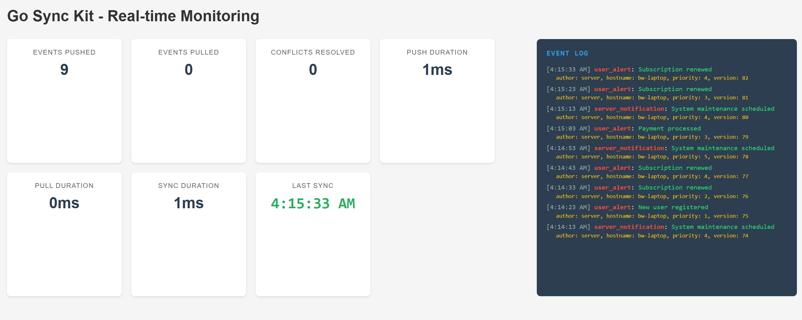

# Go Sync Kit Example

This example demonstrates a real-time event synchronization system with a live monitoring dashboard. It showcases various features of the Go Sync Kit, including event synchronization, real-time monitoring, and metrics collection.



## Features

- **Real-time Event Synchronization**: Demonstrates bidirectional event syncing between client and server
- **Live Dashboard**: Real-time monitoring of events and system metrics
- **Event Terminal**: Live event log with detailed metadata
- **Metrics Display**: Track sync statistics, event counts, and performance metrics

## Components

- `client/`: Client implementation with auto-sync capabilities
- `server/`: Server implementation with event handling and storage
- `dashboard/`: Real-time web UI for monitoring
- `metrics/`: Metrics collection and reporting
- `demo.go`: Main entry point that runs the example

## Running the Example

1. Start the example:
   ```bash
   go run .
   ```

2. Open the dashboard:
   ```
   http://localhost:8080
   ```

3. Watch real-time events and metrics in the dashboard.

## Dashboard Features

### Event Terminal
- Real-time event log
- Event type and content display
- Detailed metadata including:
  - Event version
  - Priority level
  - Author
  - Hostname
  - Timestamp

### Metrics Panel
- Events pushed/pulled counters
- Sync duration tracking
- Conflict resolution stats
- Error monitoring
- Last sync timestamp

## Architecture

The example uses several key components of Go Sync Kit:

- SQLite event store for persistence
- HTTP transport for sync communication
- Real-time event monitoring
- Auto-sync with configurable intervals
- Metrics collection and reporting

## Customization

You can customize various aspects of the example:

- Sync interval (default: 5s)
- Event types and content
- UI layout and styling
- Metrics collection
- Event metadata

## Implementation Details

- Uses SQLite with WAL mode for better concurrency
- Implements event versioning for sync consistency
- Provides real-time metrics updates
- Features responsive dashboard design
- Includes error handling and reporting
## Graceful Shutdown

All commands handle graceful shutdown on SIGINT (Ctrl+C) or SIGTERM signals:
1. Context cancellation is triggered
2. Both client and server perform cleanup
3. Database connections are properly closed
4. Process exits cleanly
